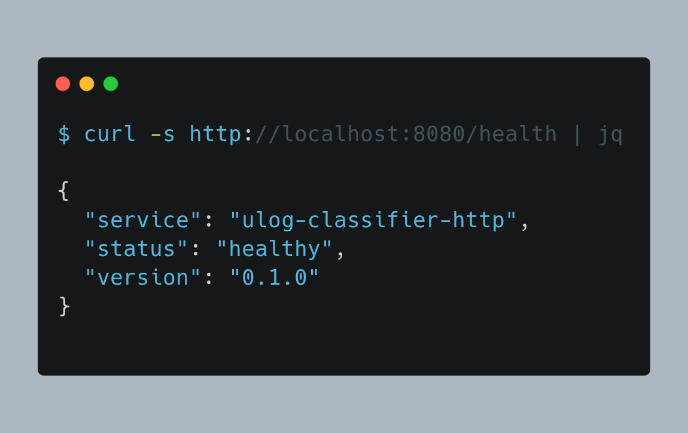
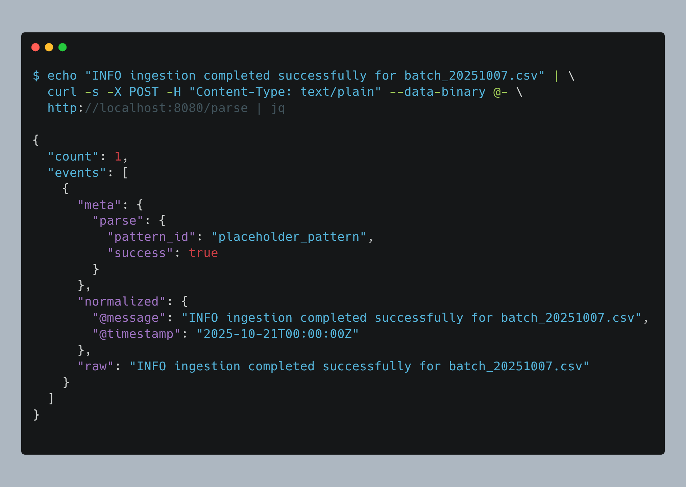
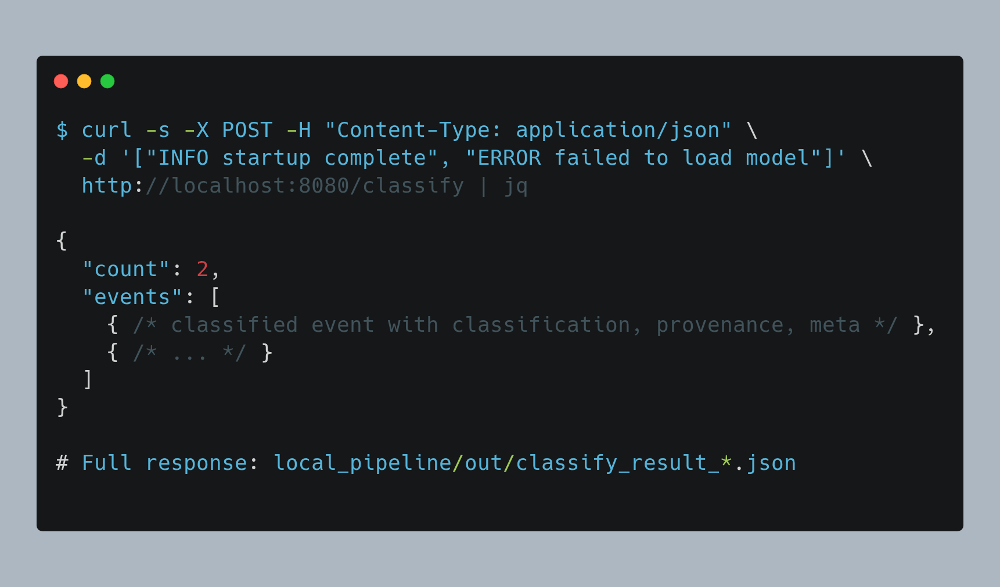

# ULog Local Pipeline

Docker Compose setup for running the ULog classifier locally with HTTP service.

## Services

### `classifier`

Batch processing service that reads from `/in` and writes to `/out`.

### `classifier-http`

HTTP REST API for interactive parsing and classification.

**Endpoints:**

- `GET /health` - Health check (used by Docker healthcheck)
- `POST /parse` - Parse raw log lines to normalized JSON (debug)
- `POST /classify` - Full pipeline: parse → validate → classify → annotate

**Port:** 8080 (configurable via `PORT` env var)

## Quick Start

### 1. Setup Environment

Ensure `../.env` exists with PORT/LOG_LEVEL.

### 2. Start Services

```bash
# Start HTTP service
docker compose up -d classifier-http

# Verify service is healthy
docker compose ps
```

**Test health endpoint:**

```bash
curl http://localhost:8080/health
```

**View logs:**

```bash
docker compose logs -f classifier-http
```

### 3. Run Smoke Tests from root project folder

```bash
./scripts/smoke_http.sh
```

**Expected output:**

```
==========================================
ULog HTTP Classifier Smoke Test
==========================================
Base URL: http://localhost:8080
Output dir: local_pipeline/out

[1/3] Testing GET /health
✓ Health check passed

[2/3] Testing POST /parse (raw lines)
✓ Parse endpoint passed

[3/3] Testing POST /classify (JSONL)
✓ Classify endpoint passed

[Bonus] Testing POST /classify (JSON array)
✓ Classify (JSON array) passed

==========================================
All smoke tests passed!
==========================================
```

**Results saved to `./out/`:**

- `health_*.json` - Health check response
- `parse_result_*.json` - Parse endpoint results
- `classify_result_*.json` - Classify endpoint results (JSONL)
- `classify_array_*.json` - Classify endpoint results (JSON array)

### 4. Manual Testing

#### Health Check

**Command:**

```bash
curl http://localhost:8080/health
```

**Response:**

```json
{
  "status": "healthy",
  "service": "ulog-classifier-http",
  "version": "0.1.0"
}
```



---

#### Parse Endpoint

**Command:**

```bash
echo "INFO ingestion completed successfully for batch_20251007.csv" | \
  curl -X POST -H "Content-Type: text/plain" \
  --data-binary @- \
  http://localhost:8080/parse
```

**Response snippet:**

```json
{
  "count": 1,
  "events": [
    {
      "raw": "INFO ingestion completed successfully for batch_20251007.csv",
      "normalized": {
        "@message": "INFO ingestion completed successfully for batch_20251007.csv",
        "@timestamp": "2025-10-21T00:00:00Z"
      },
      "meta": {
        "parse": {
          "pattern_id": "placeholder_pattern",
          "success": true
        }
      }
    }
  ]
}
```



For full response examples, see `./out/parse_result_*.json` after running the smoke test.

---

#### Classify Endpoint (JSONL)

**Command:**

```bash
cat > sample.jsonl <<EOF
{"raw": "INFO ingestion completed successfully"}
{"raw": "ERROR timeout after 30s"}
EOF

curl -X POST \
  -H "Content-Type: application/x-ndjson" \
  --data-binary @sample.jsonl \
  http://localhost:8080/classify
```

**Response snippet:**

```json
{
  "count": 2,
  "events": [
    {
      "raw": "INFO ingestion completed successfully",
      "normalized": {...},
      "classification": {
        "level": "info",
        "category": "system",
        "outcome": "success"
      },
      "provenance": {
        "parser_rule_id": "placeholder_parser",
        "classifier_rule_id": "placeholder_classifier",
        "timestamp": "2025-10-21T00:00:00Z"
      },
      "meta": {
        "parse": {
          "pattern_id": "placeholder_pattern",
          "success": true
        },
        "validation": {
          "schema": "core_api",
          "valid": true
        }
      }
    }
  ]
}
```



For full response examples, see `./out/classify_result_*.json` after running the smoke test.

---

#### Classify Endpoint (JSON Array)

**Command:**

```bash
curl -X POST \
  -H "Content-Type: application/json" \
  -d '["INFO startup complete", "ERROR failed to load model"]' \
  http://localhost:8080/classify
```

**Response:** Similar structure to JSONL format above. See `./out/classify_array_*.json` for examples.

### 5. Stop Services

```bash
docker compose down
```

## Environment Variables

| Variable | Default | Description |
|----------|---------|-------------|
| `PORT` | `8080` | HTTP service port |
| `LOG_LEVEL` | `INFO` | Logging verbosity (DEBUG, INFO, WARN, ERROR) |

## Directory Structure

```
local_pipeline/
├── docker-compose.yml       # Service definitions
├── classifier/
│   ├── Dockerfile           # Batch processor image
│   ├── Dockerfile.http      # HTTP service image
│   ├── app.py              # Batch processor
│   └── http_app.py         # HTTP service
├── in/                     # Input files (mounted)
├── out/                    # Output files (mounted)
└── README.md               # This file
```

## Output Files

The smoke test script creates timestamped files in `./out/`:

- `health_YYYYMMDD_HHMMSS.json` - Health check response
- `parse_result_YYYYMMDD_HHMMSS.json` - Parse endpoint results
- `classify_result_YYYYMMDD_HHMMSS.json` - Classify endpoint results
- `sample_raw_YYYYMMDD_HHMMSS.txt` - Sample input (raw)
- `sample_events_YYYYMMDD_HHMMSS.jsonl` - Sample input (JSONL)

## Healthcheck

The HTTP service includes a Docker healthcheck that:

- Polls `GET /health` every 60 seconds
- Times out after 3 seconds
- Retries 3 times before marking unhealthy
- Waits 10 seconds before first check

Check service health:

```bash
docker compose ps
# Look for "healthy" status
```

## Troubleshooting

**Service won't start:**

```bash
# Check logs
docker compose logs classifier-http

# Rebuild image
docker compose build classifier-http
docker compose up -d classifier-http
```

**Port already in use:**

```bash
# Change port in .env
echo "PORT=8081" >> ../.env

# Restart
docker compose down
docker compose up -d classifier-http
```

**Healthcheck failing:**

```bash
# Check if service is responding
curl -v http://localhost:8080/health

# Check container logs
docker compose logs classifier-http
```

## Development Notes

This setup is ready for ticket 2.2 integration. The HTTP service currently returns placeholder responses. Once ticket 2.2 is complete:

1. Wire `http_app.py` to the actual normalizer, validator, and classifier modules
2. Update `Dockerfile.http` to copy the classifier package
3. Add proper `requirements.txt` from poetry export
4. Update response schemas to match actual pipeline output

See `../docs/screenshots/` for example curl interactions and responses.
